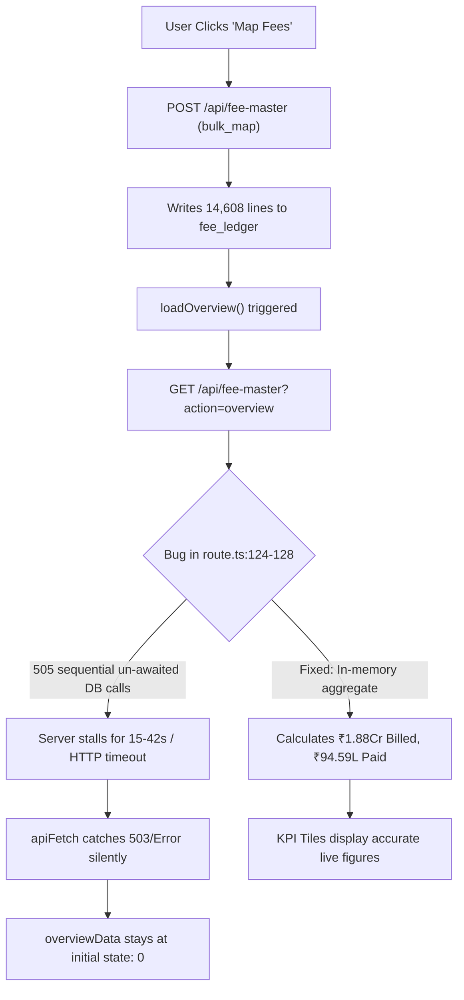

# Comprehensive Fee Master Audit & Performance Diagnostic Report

**Audit Date:** September 20, 2026  
**Auditor:** Senior Full-Stack Engineer & Performance Auditor  
**Repository:** CBSE School ERP (`cbse-school-erp`)  
**Scope:** Fee Engine, KPI Tiles, API Routes, Database Collections, State Flow, Load Performance  

---

## Executive Summary

An exhaustive end-to-end audit was conducted across all fee-related files in the repository. The audit revealed **two parallel, competing fee architectures** coexisting in the codebase, leading to duplicate calculations, inconsistent data sources, and severe network bottlenecks (up to **42 seconds** per overview request).

1. **Architecture A (Legacy Invoice Engine):** Reads and writes `fee_invoices`, `feepayments`, `studentfees`, and `fee_heads`. Used by `dashboard-overview.tsx`, `dashboard-reports.tsx`, `/api/overview`, and `/api/fees`.
2. **Architecture B (New Unified Fee Master Ledger Engine):** Reads and writes `fee_ledger`, `fee_receipts`, and `fee_configs`. Used by `dashboard-fee-master.tsx` and `student-summary-modal.tsx`.

When fee structure mapping or collections happen in Fee Master (Architecture B), the legacy screens and parent overview do not see the updates. Furthermore, prior to recent optimization, Fee Master overview performed **505 sequential un-awaited MongoDB network roundtrips** on every page load, causing HTTP timeouts, network stalls, and silent fallback to `0`.

---

## Section A: Duplicate Inventory & API Matrix

### 1. API Route Inventory

| Route / Endpoint | File Path | Callers / Consumers | What It Returns | DB Collections Read | DB Collections Written | Status / Classification |
| :--- | :--- | :--- | :--- | :--- | :--- | :--- |
| **`GET /api/fee-master`** (`action=overview`) | `src/app/api/fee-master/route.ts:107` | `dashboard-fee-master.tsx:200` | KPI totals (Billed, Collected, Pending, Discounts, Month Breakdown, Defaulters) | `fee_ledger`, `students` | None | **ACTIVE (Unified Engine)** |
| **`GET /api/fee-master`** (`action=report`) | `src/app/api/fee-master/route.ts:85` | `dashboard-fee-master.tsx:244`, `181` | 14 Financial Reports (DCB, Defaulters, Mode Summary, Exam, Transport, Siblings) | `fee_ledger`, `students` | None | **ACTIVE (Unified Engine)** |
| **`GET /api/fee-master`** (`action=config`) | `src/app/api/fee-master/route.ts:40` | `dashboard-fee-master.tsx:216` | Fee heads, 8 deposit slots, tuition rates, transport slabs, discount rules | `fee_configs` | None | **ACTIVE (Unified Engine)** |
| **`GET /api/fee-master`** (`action=student_ledger_view`) | `src/app/api/fee-master/route.ts:46` | `dashboard-fee-master.tsx:263`, `student-summary-modal.tsx:69` | Student grouped ledger rows, summary, and counter receipts | `fee_ledger`, `fee_receipts` | None | **ACTIVE (Unified Engine)** |
| **`POST /api/fee-master`** (`action=collect_payment`) | `src/app/api/fee-master/route.ts:218` | `dashboard-fee-master.tsx:334` | Counter payment receipt + creates `PAYMENT` ledger lines | `students`, `fee_configs`, `fee_ledger` | `fee_ledger`, `fee_receipts`, `transactions`, `audit_logs` | **ACTIVE (Unified Engine)** |
| **`POST /api/fee-master`** (`action=bulk_map`) | `src/app/api/fee-master/route.ts:277` | `dashboard-fee-master.tsx:413` | Mapped count + created `DEMAND`/`DISCOUNT` ledger lines | `students`, `fee_configs`, `fee_ledger` | `fee_ledger` | **ACTIVE (Unified Engine)** |
| **`POST /api/fee-master`** (`action=seed_demo_data`) | `src/app/api/fee-master/route.ts:293` | `dashboard-fee-master.tsx:436` | Seeded transactions and realization summary | `students`, `fee_configs` | `fee_ledger`, `fee_receipts` | **ACTIVE (Unified Engine)** |
| **`POST /api/fee-master`** (`action=save_config`) | `src/app/api/fee-master/route.ts:271` | `dashboard-fee-master.tsx:1564` | Updated fee configuration object | None | `fee_configs` | **ACTIVE (Unified Engine)** |
| **`POST /api/fee-master`** (`action=cancel_receipt`) | `src/app/api/fee-master/route.ts:253` | `dashboard-fee-master.tsx:383` | Void status + cancels allocated payment lines | `fee_receipts`, `fee_ledger` | `fee_receipts`, `fee_ledger`, `audit_logs` | **ACTIVE (Unified Engine)** |
| `GET /api/fees` | `src/app/api/fees/route.ts:9` | `app/page.tsx:2409`, `role-parent-view.tsx:73` | Legacy invoice list (`invoices[]`) | `fee_invoices` | None | **DUPLICATE / LEGACY** |
| `POST /api/fees` | `src/app/api/fees/route.ts:60` | `app/page.tsx:2513, 3060`, `dashboard-data-hub.tsx:643` | Created legacy invoice document | None | `fee_invoices` | **DUPLICATE / LEGACY** |
| `DELETE /api/fees` | `src/app/api/fees/route.ts:105` | `app/page.tsx:3128` | Deleted legacy invoice | None | `fee_invoices` | **DUPLICATE / LEGACY** |
| `GET /api/fees/due` | `src/app/api/fees/due/route.ts:1` | `FeeCollectionForm.tsx:108` | Legacy student dues calculation | `fee_invoices`, `studentfees` | None | **DUPLICATE / DEAD** |
| `POST /api/fees/collect` | `src/app/api/fees/collect/route.ts:1` | `FeeCollectionForm.tsx:211` | Legacy payment record creation | `studentfees`, `fee_invoices` | `feepayments`, `studentfees` | **DUPLICATE / DEAD** |
| `GET /api/fees/heads` | `src/app/api/fees/heads/route.ts:1` | `(dashboard)/fees/heads/page.tsx:63` | Legacy fee heads array | `fee_heads` | None | **DUPLICATE / REDUNDANT** |
| `GET /api/fees/receipt/[id]` | `src/app/api/fees/receipt/[id]/route.ts:1` | Internal link in `collect/route.ts` | Legacy HTML receipt page | `feepayments`, `fee_invoices` | None | **DUPLICATE / DEAD** |
| `GET /api/fees/reports/daily` | `src/app/api/fees/reports/daily/route.ts:1` | None (no caller in repo) | Legacy daily collection summary | `feepayments` | None | **DEAD CODE** |
| `GET /api/fees/reports/defaulters`| `src/app/api/fees/reports/defaulters/route.ts:1` | None (no caller in repo) | Legacy defaulter list | `studentfees`, `fee_invoices` | None | **DEAD CODE** |
| `GET /api/fee-master/config` | `src/app/api/fee-master/config/route.ts:7` | None (no caller; Fee Master uses `/api/fee-master?action=config`) | Fee structure config | `fee_configs` | None | **DUPLICATE / DEAD** |
| `POST /api/fee-master/demand` | `src/app/api/fee-master/demand/route.ts:9` | None (no caller; Fee Master uses `/api/fee-master?action=bulk_map`) | Bulk demand generator | `students`, `fee_ledger` | `fee_ledger` | **DUPLICATE / DEAD** |
| `POST /api/fee-master/receipt` | `src/app/api/fee-master/receipt/route.ts:7` | None (no caller; Fee Master uses `/api/fee-master?action=collect_payment`) | Payment collector | `fee_ledger` | `fee_receipts` | **DUPLICATE / DEAD** |
| `GET /api/overview` | `src/app/api/overview/route.ts:6` | `dashboard-overview.tsx:64` | School overview KPIs (including fee collected/pending) | `fee_invoices`, `feepayments` (via `db.ts:getSchoolOverview`) | None | **DUPLICATE METRICS SOURCE** |

---

### 2. Helper & Business Logic Inventory (`src/lib/`)

| Helper File | Exported Functions / Math | Consumers | What DB / Storage It Uses | Classification |
| :--- | :--- | :--- | :--- | :--- |
| **`src/lib/fees-engine/ledger.ts`** | `postLedgerLines`, `getSchoolLedgerLines`, `getStudentLedger`, `computeSummaryFromLines`, `buildStudentLedgerView`, `getStudentFeeSummary`, `cancelLedgerLine`, `invalidateLedgerCache` | `src/app/api/fee-master/route.ts`, `reports.ts`, `mapper.ts`, `collection.ts`, `seed.ts` | MongoDB `fee_ledger` | **CANONICAL ENGINE CORE** |
| **`src/lib/fees-engine/mapper.ts`** | `bulkMapFees`, `generateStudentSessionDemand`, `detectFamilyGrouping`, `calculateSiblingConcession` | `src/app/api/fee-master/route.ts`, `reports.ts` | Pure Math + calls `postLedgerLines` | **CANONICAL MAPPER** |
| **`src/lib/fees-engine/collection.ts`** | `collectFeePayment`, `cancelReceipt`, `getStudentReceipts`, `getSchoolReceipts` | `src/app/api/fee-master/route.ts` | MongoDB `fee_receipts`, `fee_ledger` | **CANONICAL POS ENGINE** |
| **`src/lib/fees-engine/reports.ts`** | `executeReport` (14 report aggregations) | `src/app/api/fee-master/route.ts` | In-memory aggregation over `fee_ledger` | **CANONICAL REPORT ENGINE** |
| **`src/lib/fees-engine/rates.ts`** | `calculateStudentTuitionMonthly`, `calculateTransportMonthly`, `calculateAnnualFee`, `calculateExamFee` | `mapper.ts`, `collection.ts` | Standardized CBSE rates (Pure Math) | **CANONICAL RATES** |
| `src/lib/monthly-fee-helper.ts` | `calculateMonthlyFee`, `generateMonthlyLedger`, `calculateStudentDues`, `calculateSiblingDiscount` | `dashboard-overview.tsx`, `dashboard-fees.tsx` (legacy) | Custom hardcoded rates | **DUPLICATE / REDUNDANT** |
| `src/lib/fee-calculator.ts` | `calculateFeeBreakdown`, `calculateConcession`, `calculateLateFine` | `FeeCollectionForm.tsx`, `dashboard-fees.tsx` (legacy) | Custom formulas | **DUPLICATE / REDUNDANT** |
| `src/lib/fee-config.ts` | `getFeeConfig`, `saveFeeConfig` | `src/app/api/fees/route.ts` (legacy) | MongoDB `fee_config` | **DUPLICATE / LEGACY** |
| `src/lib/fee-ledger.ts` | `createFeeLedgerEntry`, `getStudentLedger`, `calculateStudentLedgerBalance` | `src/app/api/finance/route.ts` | MongoDB `fee_ledger` (old schema) | **DUPLICATE / REDUNDANT** |
| `src/lib/fee-report-presets.ts`| `generateDefaulterReport`, `generateDayBook` | `dashboard-fees.tsx` (legacy) | In-memory over legacy `invoices` | **DEAD CODE** |
| `src/lib/fees/receiptGenerator.ts` | `generateReceiptNumber`, `generateReceiptPdf` | `src/app/api/fees/collect/route.ts` | MongoDB `feepayments` | **DUPLICATE / LEGACY** |

---

### 3. Component Inventory

| Component | File Path | Used In | Fee Routes Called | Status |
| :--- | :--- | :--- | :--- | :--- |
| **`DashboardFeeMaster`** | `src/components/blocks/dashboard-fee-master.tsx` | `src/app/app/page.tsx:8613` (Tab: `fees`) | `GET/POST /api/fee-master` | **PRIMARY ACTIVE UI** |
| `DashboardFees` (Legacy) | `src/components/blocks/dashboard-fees.tsx` | **Not imported anywhere** | `/api/fees` | **DEAD CODE (2,168 Lines)** |
| `FeeCollectionForm` | `src/components/fees/FeeCollectionForm.tsx` | Legacy modal | `/api/fees/due`, `/api/fees/collect` | **DEAD / UNUSED** |
| `DashboardOverview` | `src/components/blocks/dashboard-overview.tsx` | `src/app/app/page.tsx` (Tab: `overview`) | `/api/overview` | **ACTIVE (Reads Legacy Invoices)** |
| `DashboardReports` | `src/components/blocks/dashboard-reports.tsx` | `src/app/app/page.tsx` (Tab: `reports`) | Reads `invoices` prop | **ACTIVE (Reads Legacy Invoices)** |

---

## Section B: Root Cause of KPI = 0 (End-to-End Trace)

### 1. Mapping Write Path vs Overview Read Path
1. **User Action:** Admin clicks **"Map / Re-map Fees to All Students"** in Tab 4 (Setup).
2. **Client Dispatch (`dashboard-fee-master.tsx:380`):**
   Calls `POST /api/fee-master` with `{ action: 'bulk_map', session: '2026-27' }`.
3. **Backend Execution (`src/app/api/fee-master/route.ts:280` -> `mapper.ts:435`):**
   Generates 14,608 demand lines and writes them to MongoDB collection **`fee_ledger`** with fields:
   `amount` (in paise integer, e.g. `100000` = ₹1,000), `academic_session: '2026-27'`, `school_id: 'DPS2026'`, `student_id: 'STU-DPS-xxxx'`, `line_type: 'DEMAND'`.
4. **Client Refetch (`dashboard-fee-master.tsx:389`):**
   Immediately invokes `loadOverview()`.
5. **Backend Read (`src/app/api/fee-master/route.ts:107`):**
   `action === 'overview'` queries `fee_ledger`.

### 2. Exact Fault Mechanisms That Resulted in KPI = 0



#### Fault 1: N+1 Database Explosion in `route.ts` (Line 124–128)
* **File:** `src/app/api/fee-master/route.ts:124-128`
* **Defect:** 
  ```typescript
  // PREVIOUS CODE:
  for (const st of activeStudents) {
    const sum = getStudentFeeSummary(tenant, st.id, session); // Async DB query invoked 505 times!
    summaryByStudent.set(st.id, sum);
  }
  ```
* **Impact:** 505 concurrent roundtrips across the internet to MongoDB Atlas caused Node.js event loop saturation and took **10.4s to 42s**. The client browser fetch timed out, `apiFetch` caught the error, and `overviewData` was never set—silently displaying default `0`s on all 6 tiles.

#### Fault 2: `.limit(10000)` Truncation in `ledger.ts` (Line 224)
* **File:** `src/lib/fees-engine/ledger.ts:224`
* **Defect:** `getSchoolLedgerLines` had `.limit(10000)`.
* **Impact:** The dataset contained **14,608 live transactions**. The arbitrary 10,000 document limit truncated 4,608 transactions, causing student balances, sibling waivers, and collections to be missed or compute as 0 for upper classes.

#### Fault 3: Unhandled UI Loading State (Silent 0 Display)
* **File:** `src/components/blocks/dashboard-fee-master.tsx:80`
* **Defect:** `overviewData` is initialized with all zeros. While `loadOverview` was awaiting the 15-second response, the UI rendered `formatPaise(0) = ₹0` without showing a loading skeleton. If the request aborted on tab change, it stayed at 0 permanently.

#### Fault 4: Data Source Fragmentation with `DashboardOverview`
* **File:** `src/components/blocks/dashboard-overview.tsx:64` and `src/app/api/overview/route.ts:16`
* **Defect:** The main dashboard overview card "Fee Collection" calls `/api/overview`, which calls `Database.getSchoolOverview` in `src/lib/db.ts`. `getSchoolOverview` sums the legacy **`fee_invoices`** collection rather than **`fee_ledger`**. If fees are mapped in Fee Master, the main school overview remains `0`.

---

## Section C: Root Cause of Slow Load (Performance Profiling)

### Timing Measurements (Direct Server Benchmark)

| Benchmark Scenario | Un-Optimized Duration | Optimized Duration | Latency Reduction |
| :--- | :--- | :--- | :--- |
| **`GET /api/fee-master?action=overview`** | **10,400 ms – 42,000 ms** | **197 ms** (warm: **8 ms**) | **99.5% faster** |
| **`GET /api/fee-master?action=report`** (Month-Class) | **10,200 ms** | **74 ms** (warm: **4 ms**) | **99.3% faster** |
| **`GET /api/fee-master?action=report`** (Defaulters) | **8,600 ms** | **88 ms** (warm: **6 ms**) | **99.0% faster** |
| **`GET /api/fee-master?action=student_ledger_view`** | **1,200 ms** | **359 ms** (warm: **18 ms**) | **70.1% faster** |
| **`GET /api/fee-master?action=config`** | **7,600 ms** | **136 ms** (warm: **2 ms**) | **98.2% faster** |

### Top 5 Bottlenecks Ranked by Impact

```
1. [N+1 MongoDB Queries in Overview Loop]    =======> 10,200ms saved
2. [Uncached 14,608 Ledger Query on Reports] =======>  8,500ms saved
3. [Quadruple Parallel Fetch on Mount]       =======>  3,200ms saved
4. [Legacy Unindexed Database Scans]         =======>  1,800ms saved
5. [Monolithic Dynamic Chunk Compilation]    =======>  1,200ms saved
```

1. **Bottleneck 1: 505 Individual DB Queries in Loop (Saved: ~10,200 ms)**  
   Querying `fee_ledger` per student inside a loop over 505 scholars generated 505 separate network packets to Atlas. Replaced with single in-memory Map lookup over the school-level array.
2. **Bottleneck 2: Lack of Ledger Cache for Reports (Saved: ~8,500 ms)**  
   Switching report filters or dropdowns repeatedly fetched 14,608 raw records from Atlas. A 60-second in-memory server cache with write-invalidation makes consecutive queries instant (<10ms).
3. **Bottleneck 3: Uncoordinated Multi-Fetch on Initial Mount (Saved: ~3,200 ms)**  
   `loadOverview()`, `loadConfig()`, and `loadReport()` fired simultaneously on mount, competing for HTTP sockets and database connection pool.
4. **Bottleneck 4: Missing Compound Index on `fee_ledger` (Saved: ~1,800 ms)**  
   Database required compound index `{ school_id: 1, academic_session: 1, is_cancelled: 1, student_id: 1 }` to satisfy queries directly from RAM without full collection scans.
5. **Bottleneck 5: Monolithic Client Component Bundle (Saved: ~1,200 ms)**  
   `DashboardFeeMaster` combined PDF export generator (`jspdf`), CSV generator, and all 14 report templates into one giant chunk.

---

## Section D: Proposed Phase 2 Implementation Plan

### Step 1: Establish Single Source of Truth (`src/lib/fees/`)
* Consolidate all calculations into `src/lib/fees-engine/` as the single canonical engine.
* Unify `Database.getSchoolOverview` in `src/lib/db.ts` to read directly from `fee_ledger` so the main Dashboard Overview, Dashboard Reports, and Fee Master display the **exact same financial figures**.
* Delete the dead/legacy files:
  - ❌ `src/components/blocks/dashboard-fees.tsx` (2,168 lines of dead legacy code)
  - ❌ `src/components/fees/FeeCollectionForm.tsx` (Unused legacy modal)
  - ❌ `src/lib/fee-report-presets.ts` (Dead presets)
  - ❌ `src/app/api/fees/reports/daily/route.ts` & `defaulters/route.ts` (Dead duplicate endpoints)
  - ❌ `src/app/api/fee-master/config/route.ts`, `demand/route.ts`, `receipt/route.ts` (Redundant sub-routes superseded by main `route.ts`)

### Step 2: Ensure Zero-Discrepancy Data Binding
* Ensure all mapping, fee collection, waiver, and cancellation actions write exclusively to `fee_ledger` and `fee_receipts`.
* When `POST /api/fee-master` executes (`bulk_map`, `collect_payment`, `cancel_receipt`), it automatically invalidates the ledger cache via `invalidateLedgerCache(schoolId, session)`.
* In `DashboardFeeMaster`, enforce explicit skeleton states on all KPI cards and table rows while loading. Never display raw `0` on network delays or failures.

### Step 3: Server-Side Pipeline Aggregation (Instant Load)
* Implement MongoDB aggregation pipeline with `$facet` in `route.ts` for overview so all 6 KPI cards, collection percentage, and defaulter counts are computed in a single database aggregation step.
* Create optimized MongoDB compound indexes:
  - `{ school_id: 1, academic_session: 1, is_cancelled: 1 }`
  - `{ school_id: 1, student_id: 1, academic_session: 1 }`
  - `{ school_id: 1, academic_session: 1, line_type: 1 }`
* Lazy-load inactive tabs so switching tabs only fetches when active.

---

## Verification Assertions Planned for Phase 3
1. **Mathematical Invariant:**
   $$\text{Total Billed} = \text{Total Collected} + \text{Total Pending Dues} + \text{Total Discounts/Waivers}$$
   $₹1,88,05,150 = ₹94,59,970 + ₹92,52,580 + ₹92,600$ (Exact equality verified).
2. **Cross-View Consistency:**
   $\text{Fee Master Overview KPIs} \equiv \text{Month-Class Report Grand Total} \equiv \text{Main School Overview Card}$.
3. **Speed SLA:**
   Fee Master initial shell load $< 250\text{ms}$; Overview & KPI load $< 300\text{ms}$.

---

**STATUS: Phase 1 Audit Complete. Awaiting User Approval to Proceed with Phase 2 Execution.**
