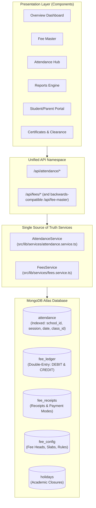

# CBSE School ERP — Full Audit & Duplicate Logic Map
**Module**: Attendance & Fees Architecture Consolidation (Phase 3)  
**Date**: September 21, 2026  
**Status**: Step 1 Complete — Single Source of Truth Blueprint  

---

## 1. Executive Summary

A comprehensive scan of the codebase was conducted to identify all locations where **Attendance** and **Fees** data are computed, aggregated, or queried directly. The audit confirmed significant fragmentation:
- **Fees**: Calculated across at least 8 distinct layers (`fees-engine/`, `lib/fees/`, `lib/stats/`, `lib/db.ts`, `api/fee-master`, `api/finance`, `dashboard-overview.tsx`, `dashboard-fee-master.tsx`, `dashboard-reports.tsx`, `app/page.tsx`).
- **Attendance**: Aggregated separately in `lib/db.ts`, `api/attendance`, `api/app-init`, `dashboard-attendance.tsx`, `dashboard-overview.tsx`, and `dashboard-reports.tsx`.

This fragmentation causes data drift, stale KPI tiles, and calculation inconsistencies (e.g. hardcoded `AS_OF_TODAY_DATE = '2026-09-20'`, FIFO payment eating Annual Fee causing the Annual Fee Pending report to show 1 student instead of all pending, and separate cache keys).

---

## 2. Duplicate Logic Map

### 2.1 Attendance Subsystem

| Location | Role / Responsibility | Query / Computation Method | Issues Identified |
|:---|:---|:---|:---|
| `src/lib/db.ts` (`getAttendance`) | Reads MongoDB `attendance` collection + fallback to in-memory store | In-memory deduplication map by date + class + section | Separate in-memory cache TTL (180s); does not compute standard percentages. |
| `src/lib/db.ts` (`recordAttendance`) | Inserts / updates attendance records in MongoDB + in-memory store | Multi-student and multi-teacher array payload | No standard validation on statuses; duplicate records possible if key mismatches. |
| `src/lib/db.ts` (`getSchoolOverview`) | Computes today's student & teacher attendance KPIs | Deduplicates records for `getTodayDateStr()`, filters faculty records, divides present by total | Re-implements attendance calculation instead of calling an attendance service. |
| `src/lib/db.ts` (`autoRecordHolidayAttendance`) | Automatically marks `HOLIDAY` status when holiday created | Loops through classes and faculty, writes to `attendance` | Direct DB access coupled inside holiday management. |
| `src/app/api/attendance/route.ts` | REST API for fetching and recording class attendance | Calls `Database.getAttendance` and `Database.recordAttendance` | Multi-tenant filtering requires centralization; returns raw untyped payload. |
| `src/app/api/attendance/scan/route.ts` | QR scan attendance recording for individual students | Finds or creates class attendance document for today, updates student record | Mutates class document directly without service abstraction. |
| `src/app/api/app-init/route.ts` | Fast application state bootstrap | Calls `Database.getAttendance(tenant, session)` | Redundant fetching of raw attendance arrays. |
| `src/components/blocks/dashboard-attendance.tsx` | Main Attendance UI & Class Marking | Calculates class percentages, monthly averages, present/absent lists | Recomputes attendance stats client-side in `useMemo`. |
| `src/components/blocks/dashboard-overview.tsx` | Executive Dashboard | Reads `overview.kpis.studentAttendanceToday` and computes local percentages | Stale if attendance updated without full page refresh. |
| `src/components/blocks/dashboard-reports.tsx` | Attendance Reports | Aggregates monthly present/absent totals per class | Independent aggregation loops. |
| `src/components/blocks/dashboard-student-portal.tsx` | Student Portal | Computes individual student attendance percentage | Calculates `(presentDays / totalDays) * 100` client-side. |

---

### 2.2 Fees & Ledger Subsystem

| Location | Role / Responsibility | Query / Computation Method | Issues Identified |
|:---|:---|:---|:---|
| `src/lib/fees/fee-service.ts` | Parallel Fee Engine (v4) | Generates in-memory demands, manages cached queries in `REPORT_CACHE` | Duplicates calculations in `fees-engine/`; generates synthetic demands instead of reading unified ledger. |
| `src/lib/fees/metrics.ts` | Fee Metrics & State Engine (v5) | `computeStudentFeeState`, `getSchoolFeeMetrics` with hardcoded `AS_OF_TODAY_DATE = '2026-09-20'` | FIFO payment allocation ignores explicit `feeHead` allocations; causes Annual Fee Pending report bug. |
| `src/lib/fees/reports/registry.ts` | 14 Report Builder Functions | Iterates `ctx.students`, calls `computeStudentFeeState` | Independent reporting registry disconnected from the core ledger. |
| `src/lib/fees-engine/ledger.ts` | Unified Fee Ledger Engine (v3) | `postLedgerLines`, `getStudentLedger`, `getStudentFeeSummary`, `getFeeAggregate` | The true double-entry ledger in MongoDB (`fee_ledger`), but bypassed by some reporting views. |
| `src/lib/fees-engine/collection.ts` | Payment Collection & Receipts | `collectFeePayment`, `cancelReceipt`, `getSchoolReceipts` | Writes to `fee_receipts` and posts credit lines to `fee_ledger`. |
| `src/lib/fees-engine/report-configs.ts` | Report Definitions & Column Schemas | Defines schemas for 15+ standard reports | Shared configs, but execution is split between `fees-engine` and `lib/fees`. |
| `src/lib/db.ts` (`getSchoolOverview`) | Overview Financial KPIs | Calls `getSchoolFeeOverviewAggregation(schoolId, targetSession)` | Caches for 30s; gets out of sync if payment events don't invalidate correctly. |
| `src/lib/db.ts` (`syncStudentFeeStatus`) | Updates student `fee_status` | Calls `getStudentLedger` or falls back to legacy `fee_invoices` | Fallback to legacy `fee_invoices` causes status discrepancies. |
| `src/app/api/fee-master/route.ts` | Primary Fee Master API | Routes actions: `overview`, `config`, `student_ledger_view`, `receipts`, `report` | Dispatches between `fees-engine` and `lib/fees`. |
| `src/app/api/finance/route.ts` | Legacy Finance API | Returns static fee heads and structures | Legacy structures disconnected from live fee configuration. |
| `src/app/api/finance/reports/pl/route.ts` | Profit & Loss Report | Queries `fee_receipts` directly for income totals | Computes income independently. |
| `src/components/blocks/dashboard-fee-master.tsx` | Fee Master UI Workspace | Calls `/api/fee-master`, manages live collections, reports, ledger | Has internal calculations for cycle multiples and head breakdowns. |
| `src/components/blocks/dashboard-overview.tsx` | Overview Dashboard | `fetchLiveFeeOverview` calls `/api/fee-master?action=overview` and `action=receipts` | Maintains separate local state `liveFeeFinancials` with manual refresh triggers. |
| `src/components/blocks/dashboard-student-portal.tsx` | Student Portal | Calls `/api/fee-master?action=student_ledger_view` | Displays itemized fee heads and receipt download. |
| `src/components/blocks/dashboard-certificates.tsx` | Transfer Certificate & Clearances | Checks student `fee_status === 'PAID'` | May see stale status if student record hasn't synced with ledger. |

---

## 3. The Unified Architecture Plan

---

## 4. Root Causes of Known Bugs & Fix Strategy

1. **Annual Fee Pending Report shows 1 student instead of all pending**:
   - *Cause*: `computeStudentFeeState` in `src/lib/fees/metrics.ts` sorted demands by date and allocated total collected payments FIFO. Since April Annual Fee was first, general tuition payments were falsely paying off Annual Fee.
   - *Fix*: In `FeesService.getAnnualFeePending()`, query the unified ledger `fee_ledger` specifically for `fee_head === 'ANNUAL'` where net balance (`DEBIT - CREDIT`) > 0.
2. **Dashboard "Fees collected" tile goes stale/wrong after a payment**:
   - *Cause*: Dual state in `DashboardOverview` (`liveFeeFinancials` vs `overview.financials`) with separate cache keys and non-synchronized memory stores.
   - *Fix*: Single canonical calculation in `FeesService.getSchoolFeeSummary()` and unified cache invalidation on payment recording.
3. **Reports Engine shows wrong data**:
   - *Cause*: Split execution between `src/lib/fees/reports/registry.ts` and `src/lib/fees-engine/`.
   - *Fix*: Route 100% of reports through `FeesService.executeReport()`, powered strictly by `fee_ledger` and `fee_receipts`.
